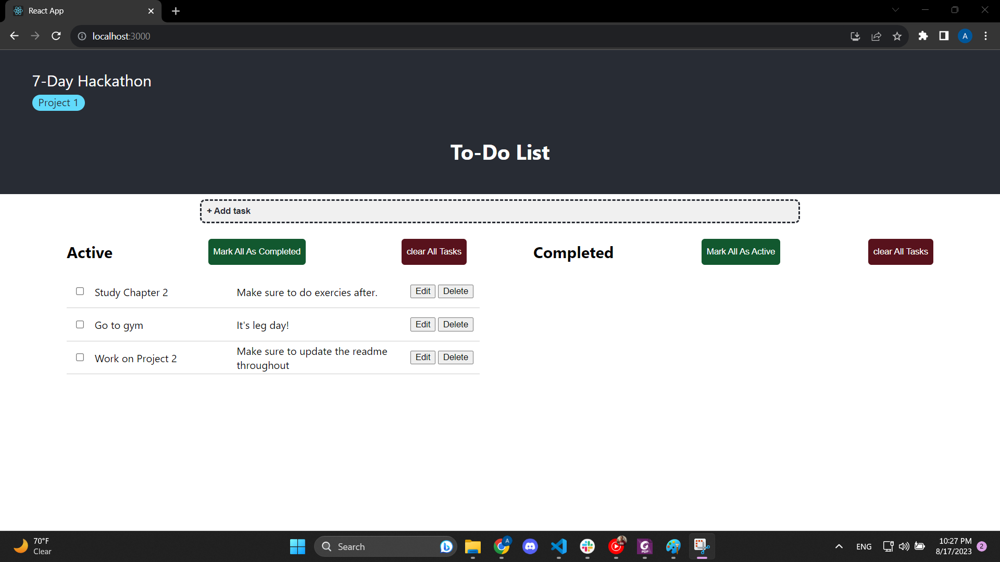

# 7-day Hackathon Project 1: To-Do List

This project is the first in the hackathon.

## User stories:

### MVP: Completed:
- [x] 1. I should be able to add a task to my to-do list.
- [x] 2. I should be able to remove a task from my to-do list.
- [x] 3. I should be able to mark a task as completed.
- [x] 4. I should be able to see all the completed tasks.
- [x] 5. I should be able to see all the uncompleted tasks.
- [x] 7. I should be able to edit the task.



### Stretch:
- [ ] 1. I want to set a due date for the task.
- [ ] 2. I want to see the tasks in order of due date.
- [ ] 3. I want to set a priority for the task.
- [ ] 4. I want to see the tasks in order of priority.
- [ ] 5. I want to categorize the tasks into different categories.
- [ ] 6. I should be able to reoder the tasks in the list.

## Learned Lessons:

### Thoughts:
 
 - I am now more aware of the difference bewteen funcation calls and function references.

- Let `myFunction` be a function that has a certain return. `myFunction()` is a call that will be invoked and give out the return, and then the return will be used in place of the function.

- If `myFunction()` is intended to be used as a *callback* for an event, this is not the correct way to do it. For example, this line
```
JSX
<button onClick={myFunction()}>Click me</button>
```
will invoke the function once the button renders. 

- The correct way of doing this is to pass in a *reference* to `myFunction()`, which will be `myFunction`. This is as follows:
```
JSX
<button onClick={myFunction}>Click me</button>
```
In this line, the function `myFunction()` will be called only when the button is clicked, which will execute the code inside the function.

### Best Practices:

Working with callbacks in React can get tricky. Therefore, the best practices for dealing with callbacks are:

- **Do not invoke the function when passing it as a callback:** Avoid using parentheses when passing a function as a callback. Always pass the reference to the function without invoking it.

- **Use arrow functions or bind:** When passing a function that requires specific context or arguments, two ways of doing this is by either using *arrow functions* or the `.bind()` method to ensure that the function is invoked with the correct context and arguments. An example for the *arrow notation* vs using `.bind()` is as follows:
```
JSX
<button onClick={() => myFunction(argument)}>Click me</button>
```
```
JSX
<button onClick={myFunction.bind(this, argument)}>Click me</button>
```

- Lastly, **I can avoid exessive re-renders.** This is by using `useCallback`. When passing in references of functions as props to a child component, there is the risk of re-rendering this child component every time the parent renders. To avoid this, using the hook `useCallback` is a good idea. `useCallback` memoizes the function and ensures it only changes when its `dependencies` change. This is an example of using the hook:
```
JSX
import { useCallback } from 'react';

const MyComponent = ({ onClick }) => {
    const myFunction = useCallback(() => {
        onClick(argument);
    }, [onClick]);

    return (
        <button onClick={myFunction}>Click me</button>
    );
};
```   

## To run the project:

Clone the repo and in the project directory, you can run:

### `npm start`

Runs the app in the development mode.\
Open [http://localhost:3000](http://localhost:3000) to view it in your browser.

The page will reload when you make changes.\
You may also see any lint errors in the console.